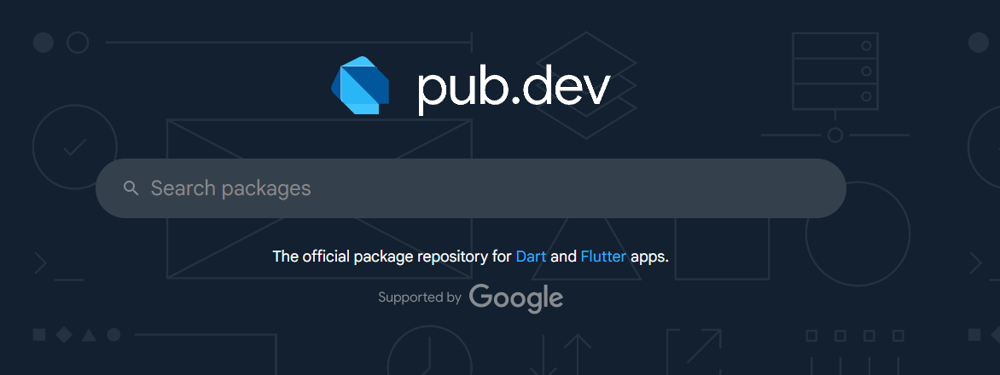
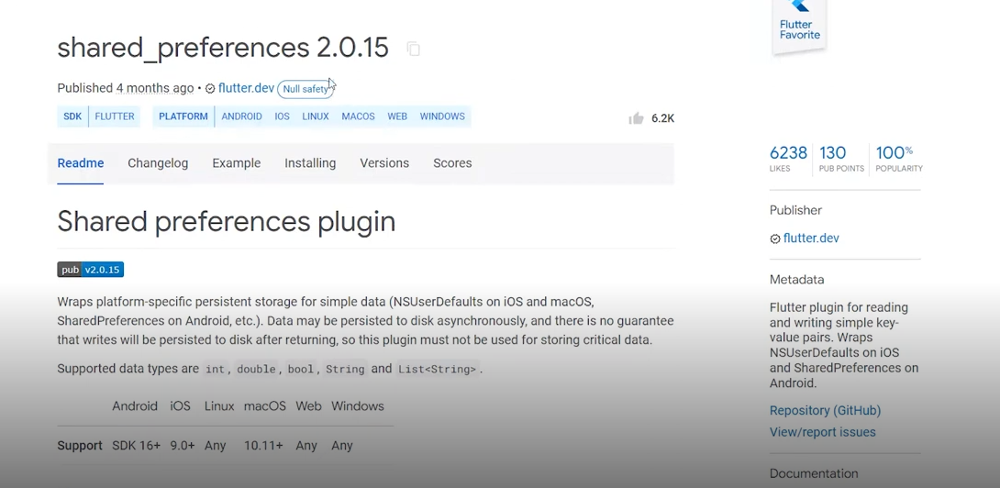
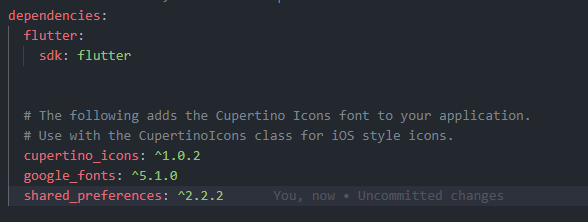
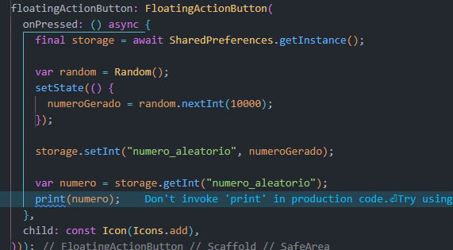
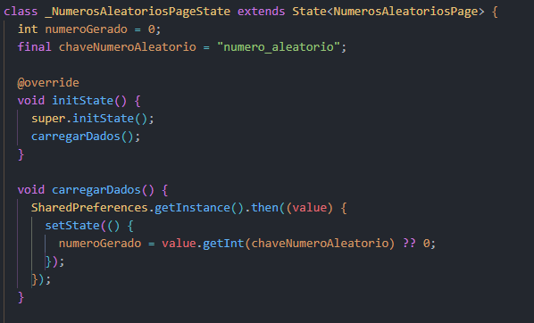
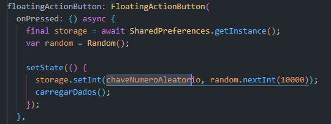
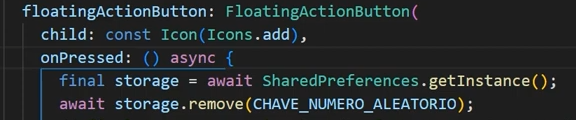

## Conhecendo o Shared Preference

## Escrevendo e lendo com o Shared Preference

### Remover um valor de Shared Preference

## Criando Tela de configuracoes

## Aplicando Shared Preferences Na Tela de Dados Pessoais

## configurando Classe de Storage

## Usando  a Classe de Storage

